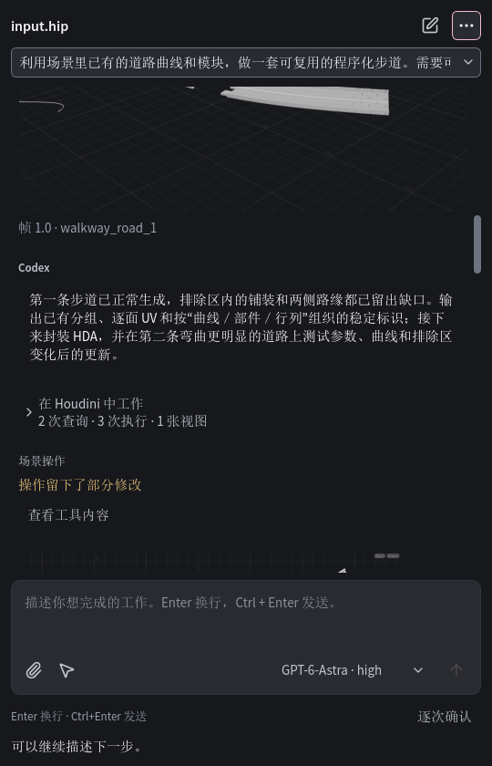
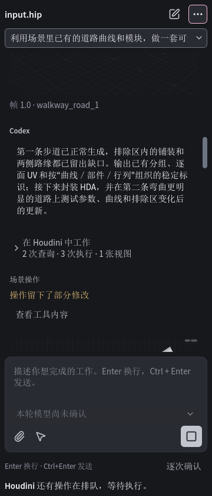
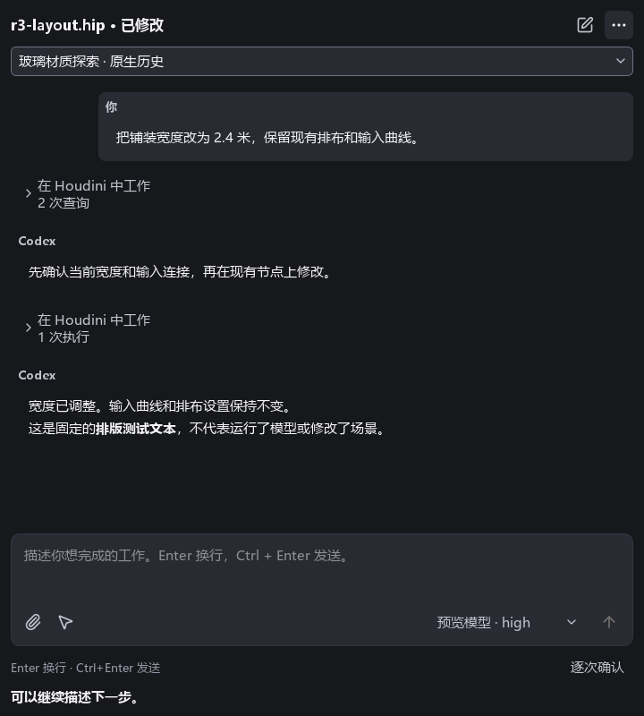
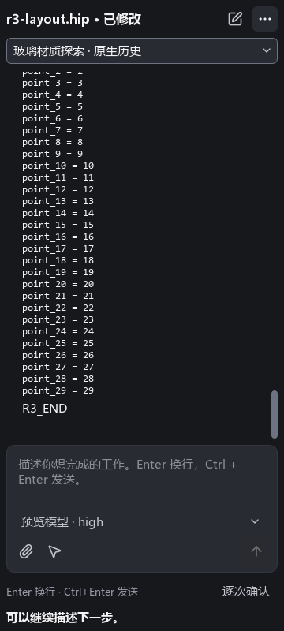
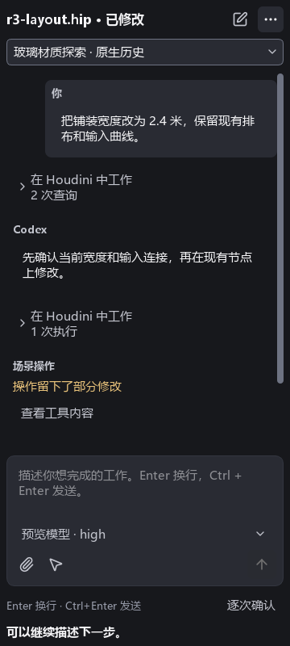
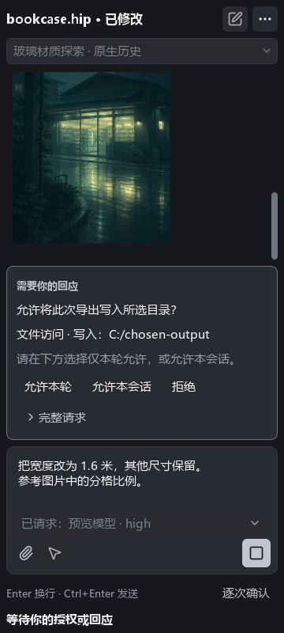
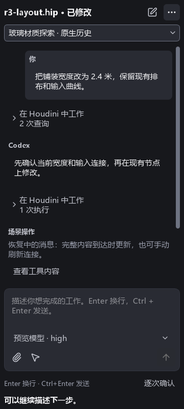
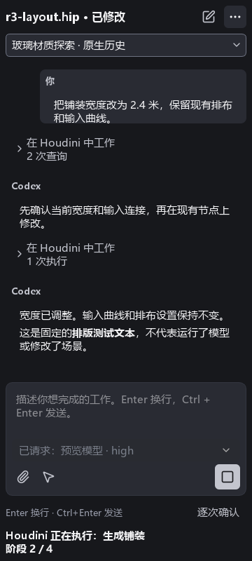
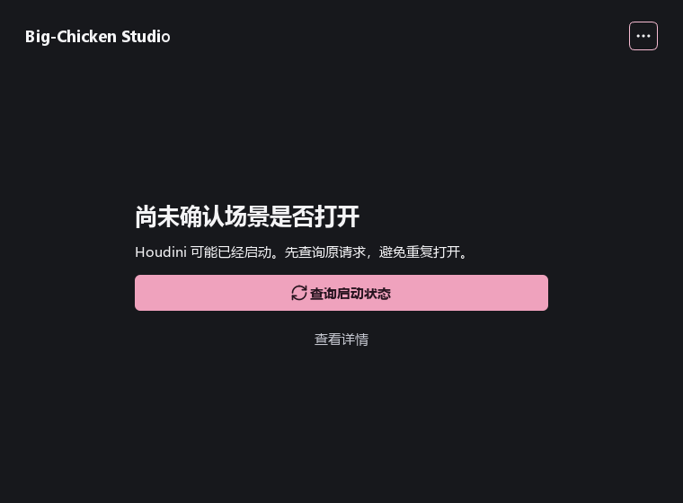

# R3 native UI evidence

Production-code candidate: `64343e6e29fd6b7007defe2197dbc5fb2c58e529`.
See [the validation record](../../r3-validation.md) for receipts, failures and limits.

## Real Houdini, using the assembled package

These are widgets from Houdini 22.0.368, using SideFX's own Python/Qt. They show the
original frozen TC3 history, including its unsuccessful outcomes. They do not
certify a newly generated asset or a clean-user installation. The displayed queue
status can include the explicitly labeled UI-observer operation.

## Fixtures rendered with the package's private Python/Qt

These use explicit in-memory facts and are layout evidence, not model/scene results.
The image in the approval fixture is the repository's existing decode-test image;
it is not a product background/logo, and is excluded from the installed payload.

