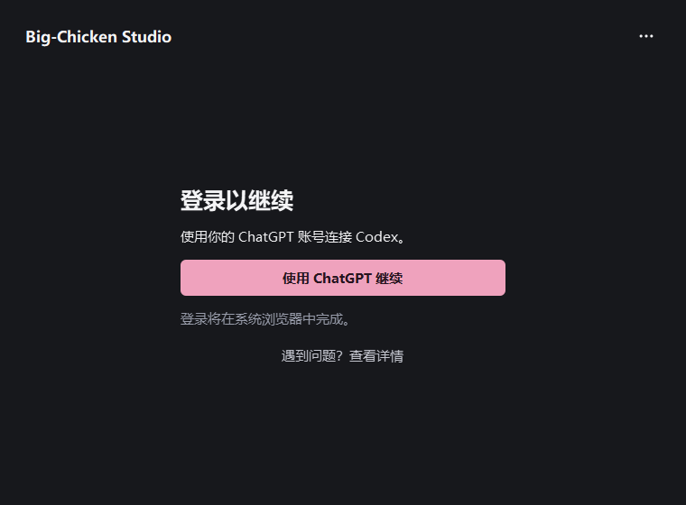
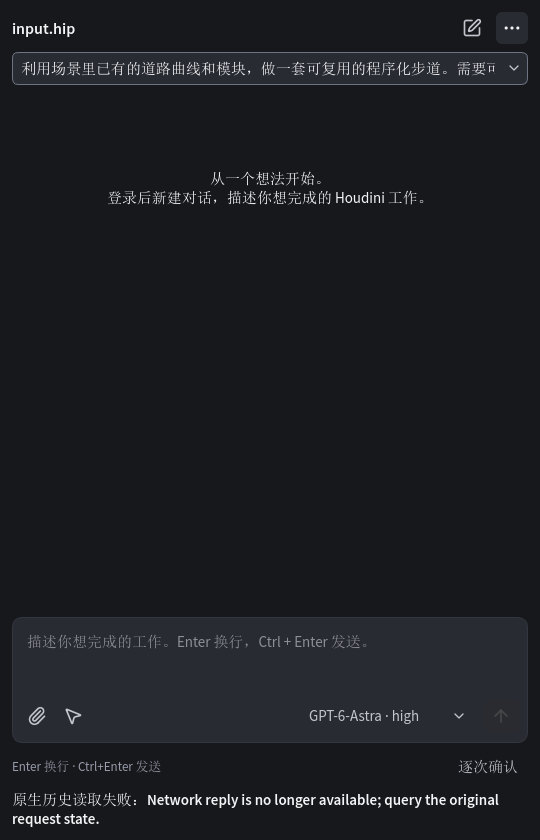

# R4 package evidence

Candidate: `3150c15041ebedca1d266305d7375f30777c25a0`.
This is an unsigned internal review package. It has **not passed release acceptance**.
See [the validation record](../../r4-validation.md) and [R4-NET-1](../../acceptance-issues.md).

## Actual packaged Launcher

The actual entry ran using private CPython 3.13.15 / Qt 6.8.3, with the Windows
platform plugin and normal installed font discovery. The window was kept off the
desktop for capture; state/cache were explicitly isolated in the checkout.
The page follows a real native Codex 0.153.4 `account/read` result of signed out.
No login, model Turn or Houdini launch occurred in this check. This is not an
installation or a clean-user Windows acceptance result.

The actual diagnostics action used controlled destination/confirmation answers.
The resulting ZIP contained only the exact [diagnostics.json](diagnostics.json)
shown here: version, installation checksum and current whitelisted facts. No
credential, chat, user path or scene/image content is included in that JSON.

## Failed real Houdini history load

This screenshot is from the integrated package in Houdini 22.0.368, with SideFX's
own Python/Qt and a dedicated HIP copy. The original native history existed, but
the Panel's reply callback failed and left the conversation empty. Later successful
reads did not close this intermittent defect; both Panels subsequently displayed
another unavailable-reply notice. It is an open release blocker.

