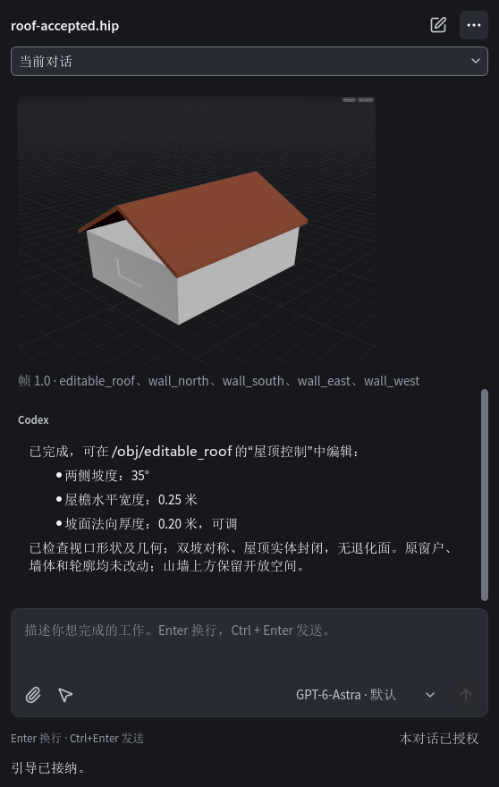

# R4 final candidate

Current decision follows [Pro's final approval](final-release-brief.md).
**PR #14 stays Draft: the Windows 11 standard-user installed workflow remains
untested.** The user currently has no suitable environment. The candidate below is
frozen for that acceptance; no account creation, authentication copying, additional
feature work, merge or public release substitutes for it.

## Candidate identity

| Field | Actual value |
| --- | --- |
| Source and builder commit | `991cbce9c90ef7e18dc9a2349ffc95082c5cb0b6` |
| Build ID | `0.1.0-rc.1-991cbce9c90e` |
| Installer | `Big-Chicken-Studio-0.1.0-rc.1-991cbce9c90e-win-x64.exe` |
| SHA-256 | `6e45d650814808e3b0f83be2256e59001cb6f49d436fbdbe49bc96660af92de9` |
| Installer bytes | 211650798 |
| Build directory | R4 worktree `.runtime/steer-final-package/` |
| Dependency lock | `release/windows-inputs.lock.json` at the source commit; copied into the package as `build-inputs.json` |
| Private runtime | CPython 3.13.15; PySide6 / Qt 6.8.3; native Codex 0.153.4 |
| Target | Windows 11 x64 / Houdini FX 22.0.368; unsigned |
| CI | All five jobs passed, [run 34453948861](https://github.com/Big-chicken-hen/Big-Chicken-Houdini-Studio/actions/runs/34453948861) |

The native/Bridge implementation is `690362f`, original-account recovery is
`af5ee27`, and Composer integration is `8292367`. `991cbce` records the contracts
and acceptance gates. Later evidence-only commits do not change this package's
source or bytes. Do not rebuild after merge and silently replace the tested file.

## Actual package results

The [single diagnostic export](evidence/r4-steer/final-package-check.json) checked
all 230 manifest files with zero missing/changed files. Private component versions
matched. The ZIP contained only `diagnostics.json`; the diagnostic read guard saw
only the manifest and its 230 installation files. Local test auth/chat/output
sentinels were preserved and never read/exported. This was preparation, not an
installation or upgrade/uninstall test.

The completed [NET-1 correction](r4-net-validation.md) was rechecked with this
steer-enabled package in fresh real Houdini session
`782443b4e1fb401f8a7f35464f31c129`: 90 seconds of polling, dual Panels, reconnect,
close/reopen and preserved draft. All eight samples of 14 canonical/copy/render
message comparisons passed; transport errors, icon diagnostics and Panel script
errors were zero. [Full comparison report](evidence/r4-steer/final-package-history.json).
No model Turn was started by that history check.

## Real same-Turn authoring

Fresh real Houdini session `1a1837ae02d44a34a006a749d2572b02` loaded an explicit
copy of the seven-object wall/window/roof-outline fixture. Its new workspace used
the already authorized isolated account in place. A real Python Panel created a
new native conversation, enabled that conversation's existing scene permission
and sent Pro's exact three messages through normal Composer controls. It used
`gpt-6-astra` with native default effort; no node instructions or injected faults.

The two additions were accepted early in the original Turn, before the four HOM
calls. Native history contains exactly one Turn and the three client IDs once in
order. The model completed in about 105 seconds. All seven Panel message sources,
copy text and rendered text matched native history; six model receipts matched
their durable records exactly. Four observed HOM inputs were unchanged. This
natural run used ordinary HOM, so staged/Stop fault coverage remains separately
controlled. [Model and receipt evidence](evidence/r4-steer/roof-model.json),
[message comparison](evidence/r4-steer/roof-messages.json).

The generated `/obj/editable_roof` exposes slope, horizontal eave width and normal
thickness controls, set to 35 degrees, 0.25 m and 0.20 m. All seven original objects
matched their pre-task node/parameter/transform/geometry baseline; no node errors
were observed. The result was saved as `roof-accepted.hip` in that session's review
directory. The owned GUI was then explicitly terminated by the test driver after
saving; its exit code 1 records that cleanup, not an unexpected application crash.

A separate fresh H22 hython process then loaded the saved HIP, cooked without
errors and exited 0. World geometry measured both sides at `35.000000974` degrees,
four horizontal eaves at `0.25 m`, and normal thickness at `0.200000008 m`.
All 20 edges belong to two oppositely oriented faces; the 10 faces are planar and
nondegenerate. In that memory-only scene, changing the controls to 30 degrees /
0.15 m / 0.10 m changed geometry correctly; restoring them reproduced the original
geometry exactly. All seven existing objects remained identical throughout. No HIP
was saved by this test, and the original file's size and modification time stayed
unchanged. [Independent fresh-load measurements](evidence/r4-steer/roof-fresh-load.json).

## Remaining acceptance

Use this exact installer for the [Chinese RC runbook](rc-acceptance.md): standard
user installation, Start menu, official login, authoring and successful working
steer, image feedback, Save As/reopen/resume, Stop, diagnostics, upgrade/uninstall
and data retention. These installed-user results are **not yet available**.
Keep the candidate frozen and PR Draft until they pass. Prior TC model-quality
gaps and Dynamic Artwork remain outside these three release gates.
